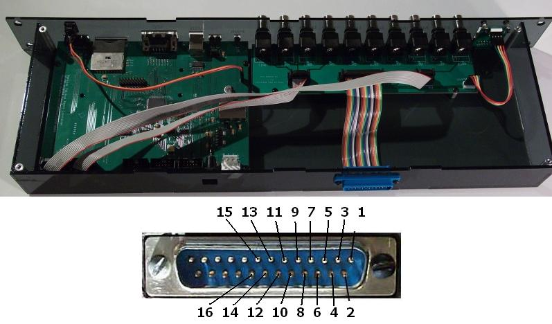

# BNC Breakout

{:.ifr .pop}

This is an additional PCB for the Controller which adds 10 BNC connections to the [Controller]({{site.baseurl}/Generation%203/Controller/docs/g3_controller.html). Have a look at the preview of the [schematics](assets/panels_bnc_breakout.pdf).

The rear breakout connection of the [BNC controller]({{site.baseurl}/Generation%203/Controller/docs/g3_controller.html) can be used to directly access the following signals:

| signal | 26pin header | 25pin D-sub (rear connector)|
|:------ |:------------:|:---------------------------:|
| 5V     |          1   |             13              |
| GND    |          2   |             25              |
| ADC0   |          3   |             12              |
| ADC1   |          4   |             24              |
| ADC2   |          5   |             11              |
| ADC3   |          6   |             23              |
| ADC4   |          7   |             10              |
| ADC5   |          8   |             22              |
| DAC0   |          9   |              9              |
| DAC1   |         10   |             21              |
| DAC2   |         11   |              8              |
| DAC3   |         12   |             20              |
| INT0   |         13   |              7              |
| INT1   |         14   |             19              |
| INT2   |         15   |              6              |
| INT3   |         16   |             18              |
